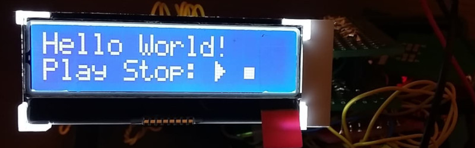

# lcd_st7032

LCD ST7032 library for avr-gcc.



(c) 2019 Bartosz Chodorowski http://chodorowski.pro

## 1) Purpose:

This is avr-gcc library for LCD displays based on Sitronix ST7032
controler.
It was tested with RAYSTAR OPTRONICS RX1602A4-BIW-TS and Atmel ATMEGA 328.

## 2) Usage:

This library uses Peter Fleury's I2C master library. Get it from:
http://www.peterfleury.epizy.com/avr-software.html

To use it, put those includes in your .c file:
```
#include "i2cmaster.h"
#include "lcd_st7032.h"
```

See lcd_st7032_example.c for usage example.

## 3) Resources:

 - https://github.com/olkal/LCD_ST7032 -- an Arduino library by Olav Kallhovd which I based this library on.
